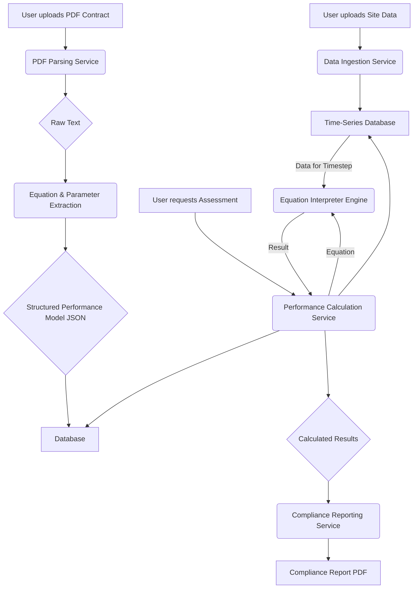

# Contract-Based Performance Model Architecture

**Author:** Manus AI  
**Date:** January 12, 2026

## 1. Overview

This document outlines the architecture for the contract-based performance assessment tool. The primary function of this tool is to automatically assess a solar farm's performance against the specific terms, equations, and data sources defined in a legal contract, which will typically be provided as a PDF document.

The system is designed to be modular, allowing for future expansion and integration with other components of the `mce-tools` ecosystem.

## 2. System Components

The architecture consists of six main services that work in a pipeline:

### 2.1. PDF Ingestion & Parsing Service

*   **Purpose:** To accept PDF contract files and extract raw text content.
*   **Technology:** Python service using a robust PDF parsing library.
*   **Primary Library:** `pdfplumber`. It is chosen over `PyPDF2` because it can also extract table data and identify the location of text on a page, which is crucial for associating numbers with parameter names.
*   **Fallback:** For scanned (non-selectable text) PDFs, the service will integrate with an Optical Character Recognition (OCR) engine like `Tesseract` (via `pytesseract`).
*   **Process:**
    1.  Receives a PDF file through an API endpoint.
    2.  Attempts to parse with `pdfplumber`.
    3.  If text extraction is minimal, it triggers the OCR process.
    4.  Stores the raw extracted text and passes it to the next service.

### 2.2. Equation & Parameter Extraction Service

*   **Purpose:** To analyze the raw text from the PDF and identify performance equations, variable definitions, and data source specifications.
*   **Technology:** Python service using Natural Language Processing (NLP) and regular expressions.
*   **Process:**
    1.  Receives raw text from the Parsing Service.
    2.  Uses a series of regular expressions to find common patterns for equations (e.g., `PR = ...`, `Expected Energy = ...`).
    3.  Uses NLP (potentially a fine-tuned model in the future, but starting with spaCy for entity recognition) to identify named entities like "In-plane Irradiance", "Module Temperature", and their associated units or variable names (e.g., `G_poa`, `T_mod`).
    4.  Identifies specified data sources (e.g., "irradiance shall be measured by the on-site Class A pyranometer").
    5.  Structures the extracted information into a machine-readable format (JSON) defining the complete performance model.
    6.  Stores this structured model in the database, linked to the specific contract.

### 2.3. Data Ingestion Service

*   **Purpose:** To ingest time-series data from the contractually specified sources (e.g., on-site meteorological station, SCADA system).
*   **Technology:** FastAPI endpoint that can accept CSV file uploads or a JSON payload.
*   **Process:**
    1.  Receives data for a specific site and time period.
    2.  Validates the data against expected columns (e.g., `timestamp`, `G_poa`, `T_mod`, `P_ac`).
    3.  Performs initial data cleaning (e.g., handling missing values, ensuring correct data types).
    4.  Stores the raw and cleaned time-series data in a time-series database (e.g., InfluxDB or TimescaleDB).

### 2.4. Equation Interpreter Engine

*   **Purpose:** To safely and dynamically evaluate the mathematical equations extracted from the contract.
*   **Technology:** A sandboxed Python environment.
*   **Process:**
    1.  Takes a parsed equation string (e.g., `(G_poa * Area) * (1 - (T_mod - 25) * 0.004)`).
    2.  Uses a safe evaluation library like `numexpr` or a custom-built parser to evaluate the expression.
    3.  **Crucially, it will NOT use `eval()` directly** to prevent arbitrary code execution vulnerabilities.
    4.  The engine will be provided with a dictionary of variables (e.g., `{'G_poa': 850, 'T_mod': 45, ...}`) for each timestep and will return the calculated result.

### 2.5. Performance Calculation Service

*   **Purpose:** To orchestrate the end-to-end performance calculation.
*   **Technology:** A central Python service that communicates with the other components.
*   **Process:**
    1.  Triggered by a user request for a specific contract and time period.
    2.  Fetches the parsed performance model (equations and parameters) from the database.
    3.  Fetches the required time-series data from the Data Ingestion Service.
    4.  Iterates through each timestep of the data.
    5.  For each step, it calls the **Equation Interpreter Engine** with the relevant data points to calculate the expected performance.
    6.  Aggregates the results over the specified period (e.g., daily, monthly).
    7.  Stores the calculated expected performance alongside the actual performance data.

### 2.6. Compliance Reporting Service

*   **Purpose:** To compare the calculated performance against the contractual requirements and generate a report.
*   **Technology:** Python service using a reporting library (e.g., `FPDF2` or `WeasyPrint`) to generate PDF reports.
*   **Process:**
    1.  Retrieves the calculated performance results and the contractual acceptance criteria (e.g., `PR >= 85%`).
    2.  Compares the results to the criteria.
    3.  Generates a summary report including:
        *   Compliance status (Pass/Fail).
        *   Calculated vs. Actual performance charts.
        *   Data quality summary.
        *   Any identified anomalies or data gaps.
    4.  Delivers the report to the user.

## 3. Data Flow Diagram

## 4. Database Schema

Please refer to the `DATABASE_SCHEMA.md` document for details on the data models for this module.
