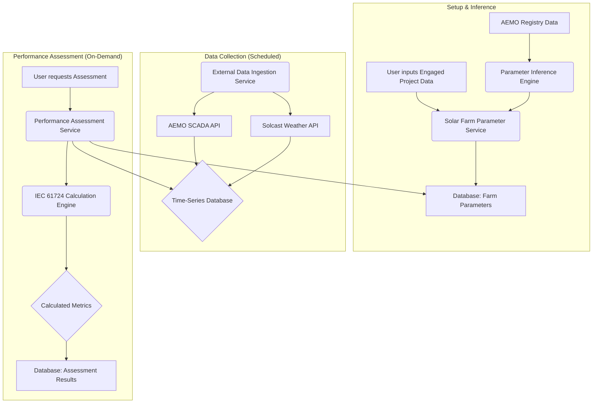

# IEC 61724-Compliant Internal Performance Model Architecture

**Author:** Manus AI  
**Date:** January 12, 2026

## 1. Overview

This document outlines the architecture for the internal performance model, which is designed to be compliant with the **IEC 61724 standard** for PV system performance monitoring. The system will calculate key performance metrics such as Performance Ratio (PR), various yields, and system losses.

A key feature of this architecture is its ability to handle two distinct use cases:

1.  **Engaged Projects:** Assessing performance for solar farms where detailed technical specifications and on-site measurements are available.
2.  **Scraped Projects:** Assessing performance for any solar farm in the NEM by using publicly available data (AEMO SCADA) and inferring the necessary technical parameters.

## 2. System Components

The architecture is composed of several interconnected services:

### 2.1. Solar Farm Parameter Service

*   **Purpose:** To manage the technical specifications for all solar farms in the system.
*   **Technology:** A CRUD (Create, Read, Update, Delete) API built with FastAPI, connected to a PostgreSQL database.
*   **Data Model:** Stores detailed parameters for each solar farm, including location, capacity, module type, inverter type, tilt, azimuth, temperature coefficients, etc. (See `DATABASE_SCHEMA.md`).
*   **Process:**
    *   For **engaged projects**, users will input detailed parameters through a UI or API call.
    *   For **scraped projects**, this service will store parameters derived from the **Parameter Inference Engine**.

### 2.2. Parameter Inference Engine

*   **Purpose:** To estimate the technical parameters for scraped projects where detailed information is not available.
*   **Technology:** A Python service that uses a combination of heuristics, lookup tables, and potentially machine learning models in the future.
*   **Process:**
    1.  Receives a DUID for a new scraped project.
    2.  Fetches basic information from the AEMO registry (e.g., capacity, location, commissioning date).
    3.  Applies a set of rules to infer missing parameters:
        *   **Tilt/Azimuth:** Infer from geographical location and standard industry practice (e.g., north-facing, tilt = latitude).
        *   **Module Technology:** Infer based on commissioning date and common technologies of that era.
        *   **Temperature Coefficient:** Use a default value based on the inferred module technology (e.g., -0.4%/°C for c-Si).
        *   **System Losses:** Apply a standard loss factor (e.g., 14-15%) as a starting point.
    4.  Saves the inferred parameters to the **Solar Farm Parameter Service** and flags them as "inferred" to denote lower confidence.

### 2.3. External Data Ingestion Service

*   **Purpose:** To fetch necessary external data for performance calculations.
*   **Technology:** A scheduled Python service (using Celery Beat) that calls external APIs.
*   **Data Sources:**
    1.  **AEMO SCADA:** Fetches 5-minute actual generation data for all DUIDs.
    2.  **Solcast API:** Fetches 5/15-minute irradiance (GHI, DNI, POA) and ambient temperature data for the specific coordinates of each solar farm.
*   **Process:**
    1.  Runs on a schedule (e.g., every 5 or 15 minutes).
    2.  Queries the Solar Farm Parameter Service to get the list of all farms and their locations.
    3.  Makes batch API calls to Solcast to retrieve meteorological data.
    4.  Fetches the latest SCADA data from AEMO.
    5.  Stores all incoming data in a time-series database (e.g., InfluxDB).

### 2.4. IEC 61724 Calculation Engine

*   **Purpose:** To perform all the core performance calculations as defined by the IEC 61724 standard.
*   **Technology:** A Python library containing a set of functions for each IEC metric.
*   **Functions:**
    *   `calculate_reference_yield(poa_irradiance)`
    *   `calculate_array_yield(dc_energy, array_capacity)`
    *   `calculate_final_yield(ac_energy, array_capacity)`
    *   `calculate_performance_ratio(final_yield, reference_yield)`
    *   `calculate_temperature_corrected_pr(...)`
    *   `calculate_array_capture_loss(reference_yield, array_yield)`
    *   `calculate_system_loss(array_yield, final_yield)`
    *   And all other metrics defined in the standard.
*   **Process:** The engine is a pure calculation library; it takes data as input and returns calculated metrics. It does not manage data fetching or storage.

### 2.5. Performance Assessment Service

*   **Purpose:** To orchestrate the performance assessment for a given solar farm and time period.
*   **Technology:** A central Python service.
*   **Process:**
    1.  Triggered by a user request or a scheduled task.
    2.  Fetches the solar farm parameters (either detailed or inferred).
    3.  Fetches the required time-series data (SCADA generation, Solcast irradiance, etc.) for the specified period.
    4.  Performs data quality checks as per IEC 61724 (e.g., filtering night-time data, checking for gaps).
    5.  Calls the **IEC 61724 Calculation Engine** with the prepared data to get the performance metrics.
    6.  Stores the calculated results (e.g., hourly/daily PR, yields, losses) in a results database (PostgreSQL).

## 3. Data Flow Diagram

## 4. Database Schema

Please refer to the `DATABASE_SCHEMA.md` document for details on the data models for this module.
